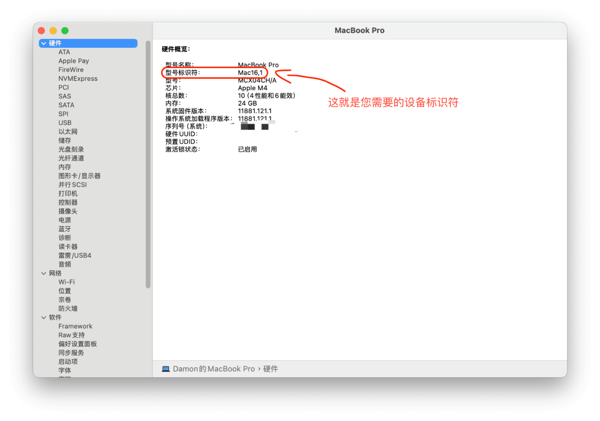
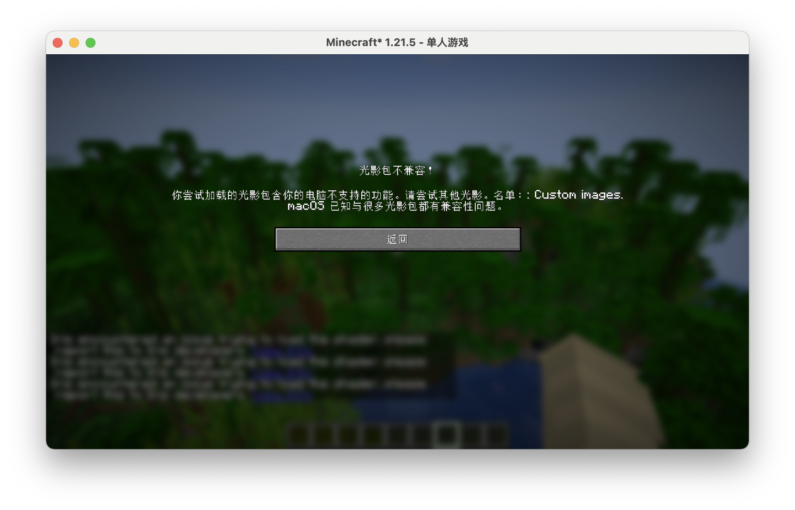
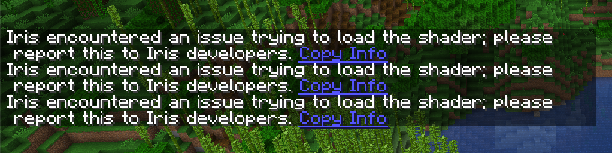
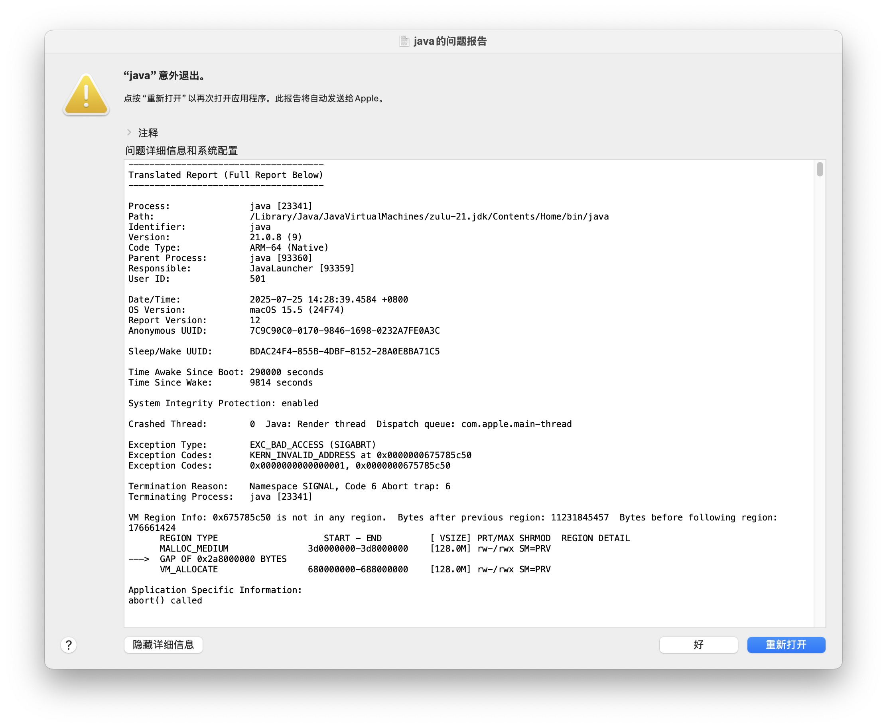
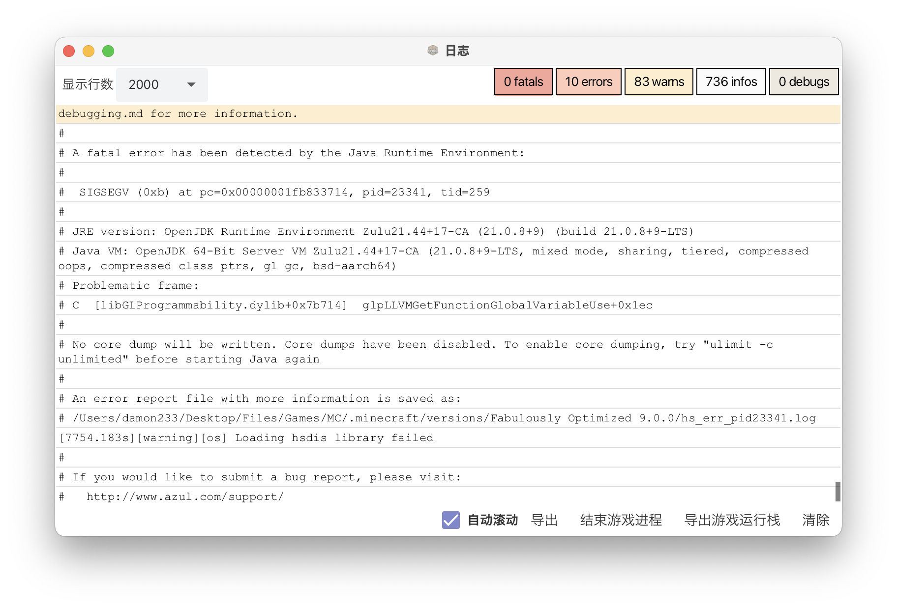

# 贡献

我不太相信一个普通消费者手里有所有 Apple Silicon Mac......

如果你可以为本文档添砖加瓦 (例如提供您拥有的设备光影支持情况, 修正错误等), 那万分感谢!

[:octicons-mark-github-16: 打开文档 GitHub 仓库](https://github.com/WhatDamon/AppleSilicon-MCShaders){ .md-button .md-button--primary }

## 贡献指南

!!! warning "警告"

    为了防止部分非 Apple Silicon Mac 用户或其他不怀好意的人破坏本仓库, 请务必遵守本指南, 否则您的测试数据不会被接受!

### 测试

#### 准备工作

=== ":material-application-outline: 软件"

    - **macOS**: 最新可用版本
    - **Java**: 优先使用 [Zulu JDK 21 ARM64](https://www.azul.com/downloads/?version=java-21-lts&os=macos&architecture=arm-64-bit&package=jdk#zulu)
    - **启动器**: 任意, 推荐 [HMCL](https://hmcl.huangyuhui.net/) 或 [Prism Launcher](https://prismlauncher.org/)
    - **Minecraft**: 请优先分它 6GB 的运行内存 (8GB 用户可以分 4GB)
        - 使用 [Fabulously Optimized](https://download.fo/) 整合包或只安装 [OptiFine](https://optifine.net/), 材质包光影请使用原版
        - 请确保游戏**不是运行在 Rosetta 2 下** (既保证运行游戏的 Java 与有关依赖都是 ARM64 体系架构, 您可以在 "活动监视器" 中查看进程 CPU 种类是否为 "Apple") !

=== ":material-monitor: 硬件"

    您需要一台拥有 Apple Silicon 的 Mac 电脑, 同时您最好知道您的设备标识符以便于您正确添加信息

    设备标识符可以在 "系统信息" 的应用中查看......

    

#### 测试流程

1. 将您将要测试的光影移至 `shaderpacks` 文件夹
2. 在游戏中启用光影
3. 按以下标准填入测试数据......
    - 如果光影成功运行, 无明显故障也无报错, 状态用 "✅" 表示
    - 如果光影成功运行但有明显故障, 或者有报错信息, 状态用 "🟠" 表示
    - 如果光影没有加载, 或者导致游戏崩溃, 状态用 "❌" 表示

!!! note "所有测试均需要在列表内提供光影名称、光影版本、游戏版本"

#### 报错信息阅读

!!! note "以下内容均以 Iris 为例"

=== ":material-box-shadow: Iris 直接警告"

    部分光影可能会使用 macOS 不支持的特性, 例如 `Custom images` 等, Iris 会直接为您提供警告信息,
    例如下图......

    

    将其中的关键信息填入错误关键内容即可

=== ":material-chat-remove-outline: 聊天栏报错"

    

    Iris 和 OptiFine 都会在出错时聊天栏中提供一些报错信息以供参考, 例如......

    ~~~
    deferred.vsh: deferred.vsh: ERROR: 0:1: '' :  version '450' is not supported
    ERROR: 0:1: '' : syntax error: #version
    ERROR: 0:2: '' :  #version required and missing.
    ~~~

    ~~~
    prepare.vsh: prepare.vsh: ERROR: 0:1: '' :  version '450' is not supported
    ERROR: 0:1: '' : syntax error: #version
    ERROR: 0:2: '' :  #version required and missing.
    ~~~

    这些儿都是 OpenGL 版本过高不支持导致的, 以上两个报错信息光影使用的 OpenGL 版本均为 4.5

    ***

    还有些光影使用了不支持的特性，例如......

    ~~~
    final.fsh: final.fsh: ERROR: 0:3: '' :  extension 'GL_ARB_shader_texture_lod' is not supported
    ~~~

    表示该光影中拓展 `GL_ARB_shader_texture_lod` 不被支持

    ***

    另外还有光影会烦会类似于这样的信息......

    ~~~
    Shader compilation failed for compute prepare!
    ~~~

    这类光影建议换一个光影加载器试试

    ***

    还有小部分光影会返回这样的错误......

    ~~~
    No more available texture units while activating sampler shadowtex1
    ~~~

    ~~~
    No more available texture units while activating sampler shadowcolor0
    ~~~

    这一类直接作为错误关键填入即可

    ***

    _如果您真无法理解其中的意思，可以考虑使用 AI 工具帮助您解析_

=== ":material-bomb: 直接崩溃"

    一般可以直接认为是 "GL 导致的 Java 崩溃"

    如果需要继续测试, 请修改崩溃光影文件名称或手动更改配置以防无法进入游戏

    

    

### 编辑 & 上传

!!! note "注意"
    
    本文档托管于 GitHub, 请先注册一个 GitHub 账号

    所有内容都必须按照 Mkdocs Markdown 语法进行编辑

!!! warning "警告"

    提交的 Issue 与 PR 请务必按照模板要求填入有关信息, 例如证明图片 (可以直接拖入编辑框内), 否则您的请求会直接被拒绝!

#### 编辑

=== ":octicons-issue-opened-16: 如果你打算提交 Issue *(简单)*"

    Issue 不用编辑文档内容, 拿着您的测试数据直接直接上传吧
    
    [点击此处打开 "新建 Issue" 界面](https://github.com/WhatDamon/AppleSilicon-MCShaders/issues/new)

    选择并按照模板要求填入即可

=== ":octicons-git-pull-request-16: 如果你打算提交 PR *(专业)*"

    !!! warning "防混淆须知"

        请务使用 `main` 分支进行贡献, 任何直接提交到 `gh-pages` 分支的 PR 不会被合并!

    请先在终端定位到存放目录后执行......

    ~~~bash
    git clone https://github.com/WhatDamon/AppleSilicon-MCShaders
    ~~~

    !!! question "没有 Git?"

        您可以通过 Homebrew 安装, 执行以下命令......

        ~~~
        brew install git
        ~~~

        您还可以通过 Xcode、MacPorts 或者直接从官网下载安装包来进行安装

    如果您需要在本地预览, 如果您尚未部署环境, 可以在定位到项目根目录后用终端执行：

    ~~~bash
    python3 -m venv venv # 创建虚拟环境
    source venv/bin/activate # 激活虚拟环境
    pip3 install mkdocs-material # 安装依赖
    mkdocs serve # 启动本地运行
    ~~~

    !!! question "没有 Python?"

        您可以通过 Homebrew 安装, 执行以下命令......

        ~~~
        brew install python
        ~~~

        您还可以通过 MacPorts、pyenv 或者直接从官网下载安装包来进行安装

        如果直接使用官方安装包, 如果你能接受依赖混乱, 也可以不创建虚拟环境直接安装

    现在您可以访问 `127.0.0.1:8000` 查看效果了 (端口不一定 100% 为 8000)

    剩下的您可以阅读[此文章](https://geek-docs.com/git/git-questions/269_git_how_to_contribute_to_someone_elses_repository.html)了解更多!

#### 上传

上传前, 我们会需要一些信息来确保您提交的信息是真实可信的, 如下照片......

__要求图片包含以下内容__

- 物理机照片
- "关于本机" 窗口
- 您编辑的内容
- 正在运行测试光影的 Minecraft (打开 F3 界面, Mac 键盘同时按下 <kbd>fn</kbd> + <kbd>F3</kbd> )

!!! note "注意"

    除了您的设备序列号以及一些隐私信息外，其他内容必须保持清晰!
    
    每一次提交都需要重新拍摄!

请将该图片按照 Issue 或者 PR 模板填入即可

### 完成

现在只要安静等待即可, 维护者会进行 Review 的!